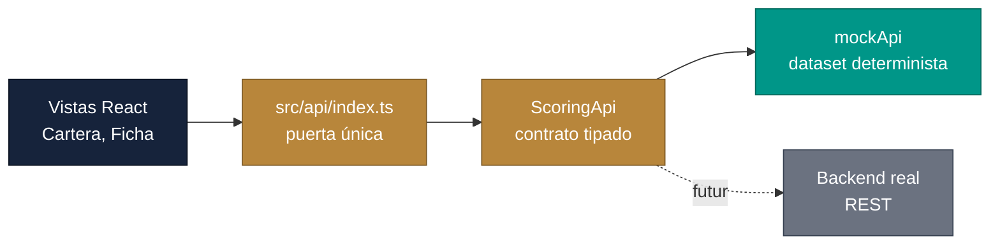

<div align="center">

  # embat-scoring

  **Guía paso a paso para construir el frontend de scoring de salud financiera de PYMEs (HackSpain, reto Embat)**

  
  
  
  
</div>

---

## Sobre el proyecto

Este repositorio documenta cómo se construye, bloque a bloque, el frontend de una herramienta que muestra la **probabilidad de deterioro financiero** de una cartera de PYMEs (score de 0 a 100, DPD, liquidez, cobros y pagos) para que un equipo de tesorería pueda actuar antes de que el problema llegue.

El frontend trabaja contra una capa de datos tipada con un **mock determinista** (1.286 empresas, 250 grupos, 24 meses). Cuando exista el backend real, solo cambia la implementación de la interfaz `ScoringApi`.

Cada decisión de diseño y cada bloque verificado están anotados en `docs/`, incluidos los descartes y sus motivos.

## Índice

- [Características](#características)
- [Arquitectura](#arquitectura)
- [Requisitos](#requisitos)
- [Inicio rápido](#inicio-rápido)
- [Guía / Capítulos](#guía--capítulos)
- [Datos](#datos)
- [Hoja de ruta](#hoja-de-ruta)
- [Licencia](#licencia)

## Características

- Vista **Cartera**: tabla semántica ordenada por riesgo, filtros por banda, sector y grupo, y destaque de las empresas cuyo score sube rápido en el mes
- Vista **Ficha de empresa**: evolución del score, DPD y liquidez con explicación en lenguaje natural
- Tema claro ("Índice de tesorería") y oscuro ("Terminal Embat") con persistencia
- TypeScript estricto (`strict`, `noUncheckedIndexedAccess`, sin `any`) y contraste AA comprobado en ambos temas
- Sin router externo: navegación por hash con un hook propio

## Arquitectura



Flujo general:

1. Las vistas solo hablan con `src/api/index.ts`; ningún fichero fuera de `src/api/` importa datos mock
2. `ScoringApi` define una función por endpoint (`listCompanies`, `getScore`, `getExplanation`, `getKpis`, ...)
3. `mockApi` genera un dataset coherente a partir de una serie latente de estrés por empresa, con contagio dentro del grupo
4. El tema y los filtros se guardan en `localStorage` / `sessionStorage` para conservar el contexto

## Requisitos

- Node.js 20 o superior
- npm

## Inicio rápido

```bash
cd frontend
npm install
npm run dev        # servidor de desarrollo
npm run build      # typecheck + build de producción
```

## Guía / Capítulos

1. [Puesta en marcha](docs/01-puesta-en-marcha.md)
2. [Arquitectura del frontend](docs/02-arquitectura-frontend.md)
3. [Decisiones de diseño](docs/03-decisiones.md)
4. [Progreso por bloques](docs/04-progreso.md)

Documento de negocio de referencia: [arquitectura.pdf](docs/arquitectura.pdf).

## Datos

Todos los datos que muestra la aplicación son **sintéticos**, generados por el mock con semilla fija. No hay empresas reales, ni datos de clientes, ni información propietaria en este repositorio. Los nombres, importes, scores y métricas del modelo (IC, ablación, SHAP) son ilustrativos.

## Hoja de ruta

- [x] Bloque 1: scaffold Vite + React + TS, tokens de diseño y toggle de tema
- [x] Bloque 2: capa de datos tipada con `mockApi`
- [x] Bloque 3: vista Cartera
- [x] Ficha de empresa (score, DPD y liquidez)
- [ ] Rendimiento del modelo (comparación A/B, curva PR)
- [ ] Benchmarks por cohorte
- [ ] Simulador de escenarios

## Licencia

Distribuido bajo la [licencia MIT](LICENSE).
