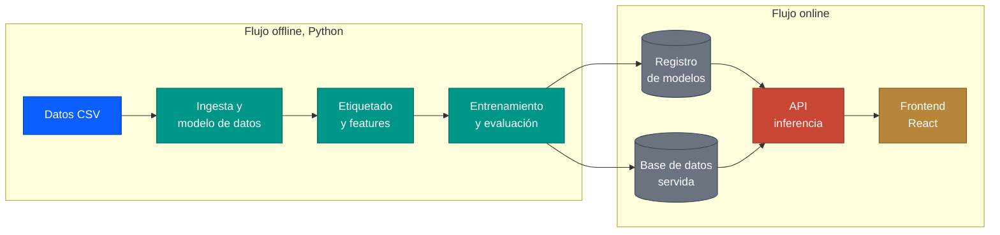

<div align="center">

  # finhackers · scoring de salud financiera de PYMEs

  **Sistema completo para anticipar el deterioro financiero de una cartera de PYMEs (HackSpain, reto Embat): datos, modelo, API y frontend**

  
  
  
</div>

---

## Sobre el proyecto

Herramienta que estima, para cada empresa de una cartera, la **probabilidad de deterioro financiero** en los próximos meses (score de 0 a 100), la explica en lenguaje natural y la compara con su cohorte, para que un equipo de tesorería actúe antes de que el problema llegue.

El proyecto cubre toda la cadena, de los datos en bruto a la pantalla, y está repartido entre varias personas del equipo:

| Parte | Qué es | Carpeta | Estado en el repo |
| --- | --- | --- | --- |
| Datos | Dataset sintético del reto (1.286 empresas, 250 grupos, 24 meses) | [`output/`](output/) | Subido |
| Pipeline y modelo | Ingesta, etiquetado, features, entrenamiento, evaluación | `pipeline/` | Lo lleva el equipo, aún no subido |
| Base de datos y API | Persistencia de scores y endpoints REST | `db/`, `backend/` | Lo lleva el equipo, aún no subido |
| Frontend | Cartera, ficha de empresa, benchmarks, simulador, rendimiento del modelo | [`frontend/`](frontend/) | En desarrollo (2 de 5 vistas) |
| Documentación | Arquitectura de referencia y guías | [`docs/`](docs/) | Subido |

La arquitectura completa, con las 12 capas, está en [docs/arquitectura.pdf](docs/arquitectura.pdf).

## Índice

- [Arquitectura](#arquitectura)
- [Estructura del repositorio](#estructura-del-repositorio)
- [Inicio rápido](#inicio-rápido)
- [Documentación](#documentación)
- [Datos](#datos)
- [Hoja de ruta](#hoja-de-ruta)
- [Cómo trabajamos](#cómo-trabajamos)
- [Licencia](#licencia)

## Arquitectura



Los dos flujos solo se comunican por el registro de modelos y la base de datos:

1. **Offline**: se ingieren los CSV, se define la variable objetivo (índice de deterioro), se construyen las features por empresa y mes, y se entrenan y evalúan los modelos (A: solo variables estructurales; B: todos los bloques)
2. **Registro y base de datos**: el modelo versionado y los scores, explicaciones, KPIs y benchmarks ya calculados
3. **Online**: la API sirve los datos y la inferencia; el frontend los muestra en cinco vistas

## Estructura del repositorio

```
.
├── output/      Dataset sintético del reto y su diccionario de datos
├── frontend/    App React + Vite + TypeScript
├── docs/        Arquitectura de referencia y guías
│   ├── arquitectura.pdf
│   └── frontend/    Guía paso a paso del frontend
├── LICENSE
└── README.md
```

Las carpetas `pipeline/`, `db/` y `backend/` se añaden al subir cada parte.

## Inicio rápido

Hoy se puede arrancar el frontend, que trabaja contra un mock mientras no exista la API:

```bash
cd frontend
npm install
npm run dev
```

Detalles en la [guía del frontend](docs/frontend/01-puesta-en-marcha.md).

## Documentación

| Documento | Contenido |
| --- | --- |
| [Arquitectura](docs/arquitectura.pdf) | Las 12 capas del sistema y el contexto de negocio |
| [Diccionario de datos](output/data_dictionary.md) | Los CSV del reto y sus columnas |
| [Frontend: puesta en marcha](docs/frontend/01-puesta-en-marcha.md) | Instalar, arrancar, scripts, rutas |
| [Frontend: arquitectura](docs/frontend/02-arquitectura-frontend.md) | Estructura, capa de datos, mock, diseño |
| [Frontend: decisiones](docs/frontend/03-decisiones.md) | Decisiones de diseño con su justificación |
| [Frontend: progreso](docs/frontend/04-progreso.md) | Qué está hecho y verificado, bloque a bloque |

## Datos

Todos los datos son **sintéticos**: no hay empresas reales, ni datos de clientes, ni información propietaria.

- `output/`: dataset del reto, descrito en [output/data_dictionary.md](output/data_dictionary.md). `invoices.csv` y `transactions.csv` pesan demasiado y están en `.gitignore`: se obtienen del zip original del reto.
- `frontend/src/api/mock/`: el frontend genera su propio dataset determinista con la misma forma, para poder trabajar sin backend. Sus scores y métricas del modelo son ilustrativos y no salen todavía del modelo real.

## Hoja de ruta

- [x] Dataset del reto en el repo
- [x] Frontend: scaffold, capa de datos tipada con mock, vista Cartera y ficha de empresa
- [ ] Pipeline: ingesta, etiquetado, features, entrenamiento y evaluación
- [ ] Base de datos y API
- [ ] Frontend: benchmarks, simulador y rendimiento del modelo
- [ ] Frontend conectado a la API real (sustituir el mock por llamadas HTTP)

## Cómo trabajamos

- `main` siempre debe funcionar
- Cada parte vive en su carpeta, para no pisarnos
- Los datos pesados no se suben; las credenciales tampoco

## Licencia

Distribuido bajo la [licencia MIT](LICENSE).
