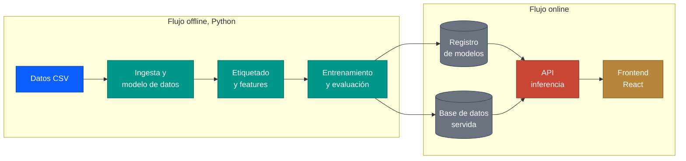

<div align="center">

  # finhackers · scoring de salud financiera de PYMEs

  **Sistema completo para anticipar el deterioro financiero de una cartera de PYMEs (HackSpain, reto Embat): datos, modelo, API y frontend**

  
  
  
  
</div>

---

## Sobre el proyecto

Herramienta que estima, para cada empresa de una cartera, la **probabilidad de deterioro financiero** en los próximos meses (score de 0 a 100), la explica en lenguaje natural y la compara con su cohorte, para que un equipo de tesorería actúe antes de que el problema llegue.

El proyecto cubre toda la cadena, de los datos en bruto a la pantalla, y está repartido entre varias personas del equipo:

| Parte | Qué es | Carpeta | Estado en el repo |
| --- | --- | --- | --- |
| Datos | Dataset sintético del reto (1.286 empresas, 250 grupos, 24 meses) | [`output/`](output/) | Subido |
| Pipeline y modelo | Ingesta, etiquetado, features, entrenamiento, evaluación, SHAP | [`pipeline/`](pipeline/) | Subido y reproducible (`python -m src.pipeline all`) |
| Base de datos y API | Scores, explicaciones y benchmarks precalculados; FastAPI con `/score` y `/simulate` | [`pipeline/src/serve_db.py`](pipeline/src/serve_db.py), [`pipeline/src/api/`](pipeline/src/api/) | Subido (mismo paquete Python que el pipeline) |
| Frontend | Cartera, ficha de empresa, benchmarks, simulador, rendimiento del modelo | [`frontend/`](frontend/) | En desarrollo (2 de 5 vistas); dashboard Streamlit de respaldo con las 5 vistas en [`pipeline/src/frontend/`](pipeline/src/frontend/) |
| Documentación | Arquitectura de referencia y guías | [`docs/`](docs/) | Subido |

La arquitectura completa, con las 12 capas, está en [docs/arquitectura.pdf](docs/arquitectura.pdf). Los resultados del modelo
(A vs B, ablación, SHAP, sensibilidad del target) están en [pipeline/README.md](pipeline/README.md).

**Resultado principal** (holdout temporal, 2.224 empresa-mes): el modelo comportamental (B) mejora al *proxy* de scoring
tradicional (A) en **+0,081 AUC-PR** (IC 95 % [+0,049; +0,112]) y de 0,759 a 0,838 de AUC-ROC; el 82 % de la importancia SHAP
viene de los bloques de comportamiento de tesorería.

## Índice

- [Arquitectura](#arquitectura)
- [Estructura del repositorio](#estructura-del-repositorio)
- [Inicio rápido](#inicio-rápido)
- [Documentación](#documentación)
- [Datos](#datos)
- [Hoja de ruta](#hoja-de-ruta)
- [Cómo trabajamos](#cómo-trabajamos)
- [Licencia](#licencia)

## Arquitectura



Los dos flujos solo se comunican por el registro de modelos y la base de datos:

1. **Offline**: se ingieren los CSV, se define la variable objetivo (índice de deterioro), se construyen las features por empresa y mes, y se entrenan y evalúan los modelos (A: solo variables estructurales; B: todos los bloques)
2. **Registro y base de datos**: el modelo versionado y los scores, explicaciones, KPIs y benchmarks ya calculados
3. **Online**: la API sirve los datos y la inferencia; el frontend los muestra en cinco vistas

## Estructura del repositorio

```
.
├── output/      Dataset sintético del reto y su diccionario de datos
├── pipeline/    Sistema Python completo (un módulo por capa de la arquitectura)
│   ├── src/         ingest · schema · labels · features · models · train · evaluate · sensitivity
│   │   ├── serve_db.py   base de datos servida (SQLite / PostgreSQL)
│   │   ├── api/          FastAPI: inferencia, endpoints, simulador
│   │   └── frontend/     dashboard Streamlit (5 vistas)
│   ├── tests/       unitarios + smoke end-to-end con datos sintéticos
│   ├── reports/     métricas, figuras y explicaciones del modelo servido
│   ├── models/      registro de modelos (metadata.json versionado)
│   ├── Makefile · Dockerfile · docker-compose.yml · requirements.txt
│   └── README.md    diseño del target, features, validación y resultados
├── frontend/    App React + Vite + TypeScript
├── docs/        Arquitectura de referencia y guías
│   ├── arquitectura.pdf
│   └── frontend/    Guía paso a paso del frontend
├── .github/workflows/ci.yml   lint + tests + smoke del pipeline
├── LICENSE
└── README.md
```

## Inicio rápido

Pipeline, API y dashboard (necesita `invoices.csv` y `transactions.csv` del zip del reto en `output/`):

```bash
cd pipeline
pip install -r requirements.txt
python -m src.pipeline all                          # ≈ 7 min: CSV → Parquet → target → features → modelos → SHAP → BD
python -m uvicorn src.api.main:app --port 8000      # API → http://localhost:8000/docs
python -m streamlit run src/frontend/app.py         # dashboard → http://localhost:8501
```

Con Docker: `cd pipeline && docker compose up --build` (postgres + api + frontend). Tests: `python -m pytest -q tests`.

Frontend React (trabaja contra un mock mientras no se conecte a la API):

```bash
cd frontend
npm install
npm run dev
```

Detalles en la [guía del frontend](docs/frontend/01-puesta-en-marcha.md) y en el [README del pipeline](pipeline/README.md).

## Documentación

| Documento | Contenido |
| --- | --- |
| [Arquitectura](docs/arquitectura.pdf) | Las 12 capas del sistema y el contexto de negocio |
| [Pipeline y modelo](pipeline/README.md) | Definición del target, bloques de features, validación temporal, resultados A vs B, ablación, SHAP, API |
| [Diccionario de datos](output/data_dictionary.md) | Los CSV del reto y sus columnas |
| [Frontend: puesta en marcha](docs/frontend/01-puesta-en-marcha.md) | Instalar, arrancar, scripts, rutas |
| [Frontend: arquitectura](docs/frontend/02-arquitectura-frontend.md) | Estructura, capa de datos, mock, diseño |
| [Frontend: decisiones](docs/frontend/03-decisiones.md) | Decisiones de diseño con su justificación |
| [Frontend: progreso](docs/frontend/04-progreso.md) | Qué está hecho y verificado, bloque a bloque |

## Datos

Todos los datos son **sintéticos**: no hay empresas reales, ni datos de clientes, ni información propietaria.

- `output/`: dataset del reto, descrito en [output/data_dictionary.md](output/data_dictionary.md). `invoices.csv` y `transactions.csv` pesan demasiado y están en `.gitignore`: se obtienen del zip original del reto.
- `frontend/src/api/mock/`: el frontend genera su propio dataset determinista con la misma forma, para poder trabajar sin backend. Sus scores y métricas del modelo son ilustrativos y no salen todavía del modelo real.

## Hoja de ruta

- [x] Dataset del reto en el repo
- [x] Frontend: scaffold, capa de datos tipada con mock, vista Cartera y ficha de empresa
- [x] Pipeline: ingesta, etiquetado, features, entrenamiento y evaluación (A vs B, ablación, SHAP, sensibilidad)
- [x] Base de datos y API (FastAPI: `/companies`, `/companies/{id}/score`, `/benchmarks`, `/score`, `/simulate`, `/model/info`)
- [x] Dashboard Streamlit con las 5 vistas (respaldo mientras el React se completa)
- [ ] Frontend React: benchmarks, simulador y rendimiento del modelo
- [ ] Frontend React conectado a la API real (sustituir el mock por llamadas HTTP a `pipeline/src/api`)

## Cómo trabajamos

- `main` siempre debe funcionar
- Cada parte vive en su carpeta, para no pisarnos
- Los datos pesados no se suben; las credenciales tampoco

## Licencia

Distribuido bajo la [licencia MIT](LICENSE).
